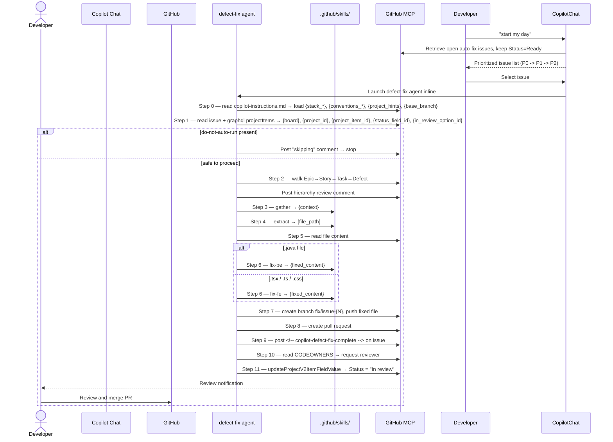

# Copilot Smart Defect Fix Agent

An intelligent multi-capability agent that responds to issue labels and workflow triggers, leveraging GitHub Copilot and Visual Studio Code to streamline bug investigation, fix creation, testing, and pull request submission.

## Operational Mechanism

This guide outlines the process by which a GitHub issue marked with the `auto-fix` label is resolved by a Copilot AI agent, progressing from labeling to pull request.

## Issue Tracking Board

Issues are monitored on a GitHub Projects board associated with this repository.
The board's name is **determined dynamically** — the agent retrieves the issue's `projectItems` using `mcp_github_graphql`. No repository-specific variables or fixed values are required.

---

## Activation Pathway

### Interactive Session (using `start` capability)

```
Developer initiates Copilot chat with "start my day"
        ↓
start capability loads copilot-instructions.md → retrieves {action_label}, {guard_label}, {priority_labels}, {base_branch}
        ↓
Capability displays available auto-fix issues in Ready status, prioritized P0→P1→P2
        ↓
Developer selects an issue number
        ↓
Capability launches defect-fix agent within the same session
        ↓
Agent executes Steps 0–11 → Pull request created → Manual review follows
```

---

## Process Flowchart



---

## Agent Configuration Loading

The agent maintains no persistent state across sessions — each begins from scratch.

**Step 0** is always: read `## Project Configuration` from `.github/copilot-instructions.md`.
This populates all placeholders used by the skills:

| Placeholder | Source section | Consumed by |
|---|---|---|
| `{action_label}` | `### Labels` | `start` skill |
| `{guard_label}` | `### Labels` | `start` skill |
| `{priority_labels}` | `### Labels` | `start` skill |
| `{stack_backend}` | `### Backend stack` | `fix-be` skill |
| `{conventions_backend}` | `### Backend stack` | `fix-be` skill |
| `{stack_frontend}` | `### Frontend stack` | `fix-fe` skill |
| `{conventions_frontend}` | `### Frontend stack` | `fix-fe` skill |
| `{project_hints}` | `### File hints` | `extract` skill |
| `{base_branch}` | `### Labels` | agent Steps 7 & 8 — branch source and PR base |

**No secrets, no variables, no injection** — everything the agent needs is in version-controlled files.

---

## Step-by-Step

### Step 0 — Load project configuration

Agent reads `.github/copilot-instructions.md → ## Project Configuration` and stores all placeholders.

---

### Step 1 — Read the issue

Agent calls `mcp_github_get_issue` for the issue number. Queries `projectItems` via `mcp_github_graphql` and stores five values for use in Step 11: `{board}` (project name), `{project_id}`, `{project_item_id}`, `{status_field_id}`, `{in_review_option_id}`.

---

### Step 2 — Walk the hierarchy

Agent walks upward via `trackedInIssues` until no more parents: Epic → Story → Task → Defect.
Posts a hierarchy review comment listing every level reviewed.

---

### Step 3 — Synthesise context (skill: `gather`)

Distils the full hierarchy into a paragraph ≤150 words: what feature this defect belongs to, what the expected behaviour is, what breaks.

---

### Step 4 — Identify the file (skill: `extract`)

Given defect title + body + context + file tree + `{project_hints}`, picks the single source file most likely responsible. Confirms it exists. Prefers Service over Controller, domain class over utility.

---

### Step 5 — Read the file

Reads the entire file — every method, field, and import — before generating any fix.

---

### Step 6 — Generate the fix

| File extension | Skill used | Stack passed |
|---|---|---|
| `.java` | `fix-be` | `{stack_backend}` + `{conventions_backend}` |
| `.tsx` / `.ts` / `.css` | `fix-fe` | `{stack_frontend}` + `{conventions_frontend}` |

Both skills enforce: fix only what the issue describes, preserve all signatures, return the complete file.

---

### Step 7 — Branch and commit

Creates `fix/issue-{N}` from `{base_branch}` (read from `copilot-instructions.md` at Step 0). Commits the fixed file. Never commits to `{base_branch}` directly.

---

### Step 8 — Open pull request

PR title: `fix: {issue title} (#{N})`. Base: `{base_branch}`. Body includes board, context summary, modified file, `Fixes #N`.

---

### Step 9 — Notify the issue (MANDATORY)

Posts `<!-- copilot-defect-fix-complete -->` comment with PR link. Session is not complete without this.

---

### Step 10 — Request review (MANDATORY)

Reads `.github/CODEOWNERS`. Requests the first matching reviewer. If no CODEOWNERS, posts a warning on the PR. Never approves or merges.

---

### Step 11 — Move issue to "In review" on the project board (MANDATORY)

Calls `mcp_github_graphql` with the `updateProjectV2ItemFieldValue` mutation using the IDs stored in Step 1. Sets the issue's **Status** field to **In review** directly on the GitHub Projects board. If the issue was not on any board (all IDs empty), skips silently.

---

## Files Involved

| File | Role |
|------|------|
| `.github/copilot-instructions.md` | Auto-loaded by Copilot — safety rules, agent compliance mandate, **Project Configuration** (labels, stacks, file hints) |
| `.github/agents/defect-fix.agent.md` | Coordinator — Steps 0–11, security validations, branch/PR/review sequence |
| `.github/agent-skills/agent-skills.md` | Capability registry — agent-skill-step mappings |
| `.github/skills/start/SKILL.md` | Daily issue browser — displays Ready issues, directs to agent |
| `.github/skills/gather/SKILL.md` | Hierarchy summarizer — Epic→Defect to ≤150-word context |
| `.github/skills/extract/SKILL.md` | File identifier — selects target file |
| `.github/skills/fix-be/SKILL.md` | Java fix generator for `.java` files |
| `.github/skills/fix-fe/SKILL.md` | React/TS fix generator for `.tsx`/`.ts`/`.css` files |
| `.github/mcp.json` | GitHub MCP server config — authenticates via Copilot session, no PAT needed |
| `.github/workflows/*` | Optional CI/automation workflows (none currently checked in this trimmed repo snapshot) |

---

## What Humans Do

| When | Action |
|------|--------|
| Before | Write a clear issue title and description |
| Before | Apply the `auto-fix` label |
| During work | Say "start my day" in Copilot chat, pick an issue |
| After PR is opened | Review the code change |
| After review | Merge or request changes |

---

## Safety Guardrails

- `do-not-auto-run` label → agent double-checks and exits immediately if present
- Agent never commits to `{base_branch}` directly
- Agent never merges its own PR
- Agent never closes the issue
- Every PR requires human approval before merge
- Board and project config discovered at runtime — no hardcoded org/project/variable values
